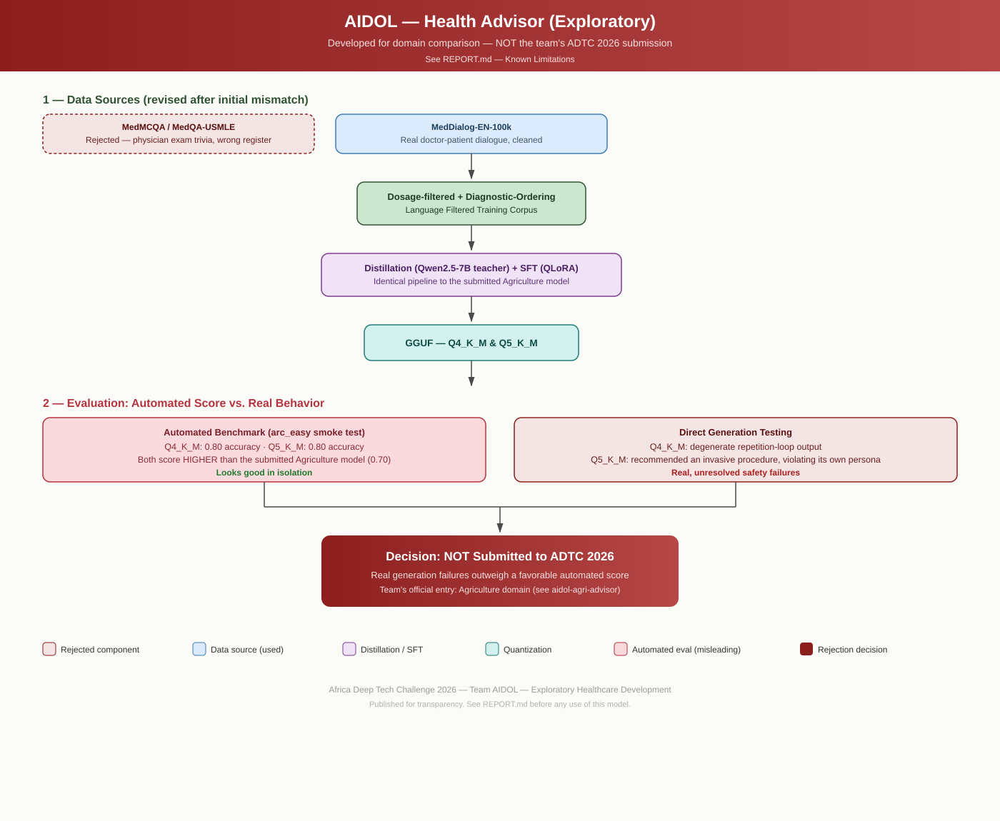

# MedicMind: Offline AI for African Health Practitioners — Health Advisor (Exploratory)


**Team:** MedicMind: Offline AI for African Health Practitioners &nbsp;·&nbsp; **Submitter:** Adegoke Israel Adedolapo &nbsp;·&nbsp; **Domain explored:** Healthcare & Medical (patient education / triage support scope)

---

## Architecture



This model was built through the same distillation + fine-tuning + quantization pipeline as the team's submitted Agriculture model, developed in parallel specifically to compare domains before choosing a final Gate 1 entry.

---

## Repository Structure

```
.
├── metadata.json          # Domain: healthcare_medical — explicitly marked non-final in cross_disciplinary_pairing
├── download_model.sh      # Downloads the quantized GGUF model — no credentials required
├── REPORT.md              # Full technical report, including detailed limitations
├── images/
│   └── pipeline_healthcare.svg
├── model/                 # Populated by download_model.sh — not committed to git
└── .gitignore
```

---

## Quick Start (for review/testing purposes only)

```bash
bash download_model.sh
adtc-profiler run --submission . --mode participant --output submission.json --skip-accuracy
```

---

## Benchmarks (measured)

| Metric | Q5_K_M (this repo) | Q4_K_M |
|---|---|---|
| Tokens/sec | 9.27 | 9.71 |
| Peak RAM | 1.23 GB | 1.67 GB |
| Accuracy (arc_easy smoke test) | 0.80 | 0.80 |
| Real generation quality | good | repetition-loop failure |

Full details, including what would be needed to make this submission-ready, in [`REPORT.md`](REPORT.md).

---

## License

Apache 2.0, consistent with the base model license.
